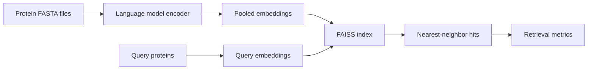

# Protein Search Evals

Protein Search Evals benchmarks protein language model embeddings for protein
sequence search. It provides a configurable pipeline for computing embeddings,
building FAISS indexes, and measuring retrieval quality on biological benchmark
datasets.

## What it provides

- Encoders for ESM-2, ESM Cambrian, and ProtTrans models
- Local and Parsl-based distributed embedding generation
- Exact, IVF, and HNSW FAISS search
- Float32 and unsigned-binary embedding indexes
- Pfam and Radical SAM evaluation datasets
- Optional PLM-BLAST reranking

## Evaluation workflow

Start with the [installation guide](getting-started/installation.md), then walk
through the [quick start](getting-started/quickstart.md). The
[architecture overview](architecture/overview.md) describes the major modules
and how data moves through the system.
